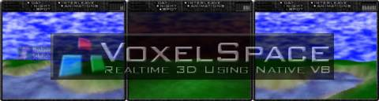



## VoxelSpace \- Realtime 3D using Native VB

### Description

VoxelSpace is a 3D demo based on classical voxel rendering

algorithms. VoxelSpace features 3D terrain rendering using

24bit depth, texture mapping, dynamic lighting, atmosphere

effect, animated water, semitranslucent overlays and more.

VoxelSpace has been developed in pure Visual Basic, though

some external library calls to the win32 api have been un-

avoidable.

System Requirements: The faster your machine, the faster a

framerate you will get. No OS restriction (works fine with

NT), no libraries (forget DirectX, OpenGL or someone elses

dlls). No display restrictions. Runs at 20+ fps on a P266.

Note: Always evaluate the compiled executable, running the

application from within the VisualBasic environment is too

slow and guarantees frustration!

Note: ALWAYS RUN IN 24bit OR 32bit COLOR MODE!
 
### More Info
 

             |
---                |---
**Submitted On**   |2001-04-19 13:51:02
**By**             |[Wolfgang Kienreich](https://github.com/Planet-Source-Code/PSCIndex/blob/master/ByAuthor/wolfgang-kienreich.md)
**Level**          |Intermediate
**User Rating**    |5.0 (110 globes from 22 users)
**Compatibility**  |VB 6\.0
**Category**       |[Graphics](https://github.com/Planet-Source-Code/PSCIndex/blob/master/ByCategory/graphics__1-46.md)
**World**          |[Visual Basic](https://github.com/Planet-Source-Code/PSCIndex/blob/master/ByWorld/visual-basic.md)
**Archive File**   |[VoxelSpace185414192001\.zip](https://github.com/Planet-Source-Code/wolfgang-kienreich-voxelspace-realtime-3d-using-native-vb__1-22513/archive/master.zip)

